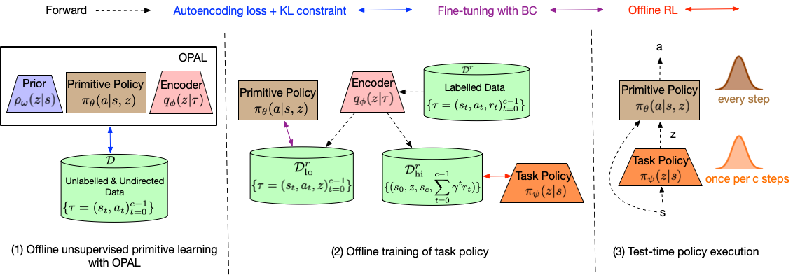

# OPAL implementation in PyTorch

## Description

This is a [PyTorch](http://pytorch.org) implementation of [OPAL: Offline Primitive Discovery for Accelerating Offline Reinforcement Learning](https://arxiv.org/abs/2010.13611).



## Prerequisites

- PyTorch
- gym
- MuJoCo
- D4RL

## Usage

```bash
python3 train.py
```
